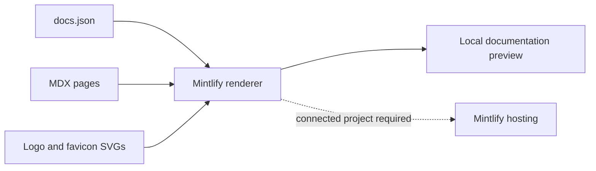
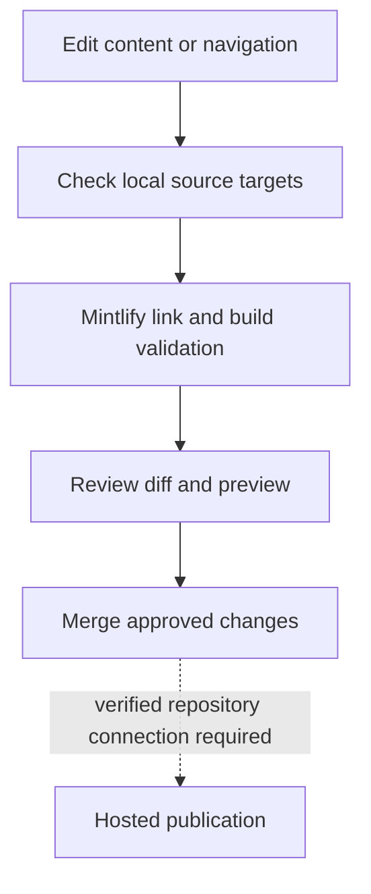

This repository is a content-only Mintlify documentation site. It has no package manifest, application backend, database or OpenAPI specification. Mintlify supplies the renderer and built-in MDX components through its CLI and hosting service.

## Source map

| Source | Responsibility |
| --- | --- |
| `docs.json` | Theme, palette, logo, favicon, navigation and external resource links |
| `index.mdx` | Introduction and navigation cards |
| `quickstart.mdx` | Local editing, preview and verification workflow |
| `docs/architecture.mdx` | Source and release boundaries |
| `docs/developer-guide.mdx` | Page conventions and maintenance checks |
| `logo/light.svg`, `logo/dark.svg`, `favicon.svg` | Original Mintlify assets |
| `scripts/check-docs.py` | Dependency-free local source checks |
| `.github/workflows/docs.yml` | Source, internal-link and Mintlify validation checks |

## Navigation and content

The sidebar lists two groups in `docs.json`: **Getting started** and **Maintaining the starter**. Each page path maps to an MDX file without its extension. Page frontmatter supplies its title and description. The introduction uses built-in `Columns`, `Card` and `Note` components; the quickstart uses `Steps` and `Step`.

The starter retains upstream Mintlify documentation, blog, support, dashboard and social links. They are external resources, not application routes or evidence of a connected deployment. The contextual menu configuration is inherited from the template; its presence does not verify those service integrations.

## Verification and publication

The source checker verifies local targets and basic structure. It does not compile MDX, render Mermaid, inspect focus behavior or prove production availability. The pinned CLI’s `broken-links` and `validate` commands provide separate link/build checks; use the recorded CI outcome when reporting them.

Hosted publication requires a separately connected Mintlify project. No live deployment URL or repository-to-host connection is asserted by these source files. The [developer guide](/docs/developer-guide) explains the checks and the [quickstart](/quickstart) explains local previewing.
